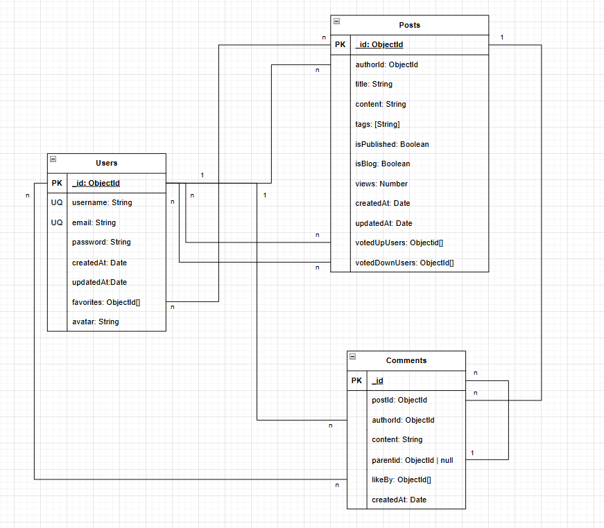

# Cơ sở dữ liệu sử dụng: MongoDB
## Lý do lựa chọn 
-	MongoDB là cơ sở dữ liệu NoSQL dạng document, rất phù hợp với các ứng dụng có cấu trúc dữ liệu linh hoạt như diễn đàn, mạng xã hội, blog…
-	Dữ liệu được lưu trữ dưới dạng JSON-like documents (BSON), giúp dễ dàng nhúng hoặc liên kết dữ liệu giữa các collections.
-	Khả năng mở rộng cao, hiệu suất truy xuất tốt với lượng lớn bài viết, comment, và người dùng.
-	Hỗ trợ phát triển nhanh, dễ tích hợp với NestJS qua mongoose ODM.

## Tổng quan các collections
Hệ thống sử dụng các collections sau:
-	`users`: quản lý thông tin người dùng
-	`posts`: quản lý bài viết blog, câu hỏi
-	`comments`: quản lý bình luận và trả lời 
-	`tags`" lưu trữ thông tin thẻ (tags) 
-	`votes`: lưu lịch sử upvote/downvote
-	`favorites`: lưu danh sách bài viết được người dùng yêu thích

## Cấu trúc chi tiết các collections
### `users`
```
{
  _id: ObjectId,
  username: String,	 // unique 
  email: String,         // unique
  password: String,      // hashed
  createdAt: Date,
  updatedAt: Date.
  favorites ObjectId[],	 //ref to posts._id
  avatar: String 
}
```
-	Khóa chính: `_id`
-	Ràng buộc: `username` và `email` là duy nhất
### `posts`
```
{
  _id: ObjectId,
  authorId: ObjectId,      	// ref to users._id
  title: String,
  content: String,         	// markdown
  tags: String[],
  isPublished: Boolean,		// true: public | false: draft 
  isBlog: Boolean,         	// true: blog | false: question
  views: Number,
  createdAt: Date,
  updatedAt: Date,
  votedUpUssers: ObjectId[],	// ref to users._id 
  votedDownUsers: ObjectId[]	// ref to users._id 
}

```
-	Khóa chính: `_id`
-	Khóa ngoại: `authorId` -> `users._id`, `votedUpUsers` -> `users._id`, `votedDownUsers` -> `users._id`
### `comments`
```
{
  _id: ObjectId,
  postId: ObjectId,        // ref to posts._id
  authorId: ObjectId,      // ref to users._id
  content: String,         // markdown
  parentId: ObjectId | null, // ref to comments._id (null nếu là trả lời bài viết)
  likedBy: ObjectId[]      // ref to users._id 
  createdAt: Date
}

```
-	Khóa chính: `_id`
-	Khóa ngoại: `postId` -> `posts._id`, `authorId` -> `users._id`, `likedBy` -> `users._id`

### Quan hệ giữa các collections

1.	Quan hệ giữa users và posts
-	Quan hệ 1-n giữa `users._id -> posts.authorId`: người dùng có thể thêm/sửa/xóa nhiều bài viết, nhưng 1 bài viết chỉ được thêm/sửa/xóa bởi 1 người duy nhất
-	Quan hệ n-n giữa `posts._id -> users.favorites`: một bài post có thể có được nhiều người thích (lưu), và 1 người cũng có thể lưu nhiều bài post. Tương tự với `posts.votedUpUsers -> users._id` / `posts/votedDownUsers -> users._id`  (1 người dùng có thể thích/không thích nhiều bài viểt và 1 bài viết có thể được nhiều người thích/không thích)
2. Quan hệ giữa users và comments
-	Quan hệ 1-n giữa `users._id -> comments._id`: một người có thể tạo nhiều bài comments nhưng 1 comment chỉ được tạo bởi 1 người
-	Quan hệ n-n giữa `comments.likeBy -> users._id`: một comments có thể được thích bởi nhiều ngưởi, và 1 người có thể thích nhiều comments 
-	Quan hệ 1-n giữa `comments.parentId -> comments._id`: 1 comment chỉ có duy nhất 1 comment cha, nhưng 1 comment cha có thể chứa nhiều comment con 
3. Quan hệ giữa posts và comments 
-	Quan hệ 1-n giữa `posts._id -> comments.postId`: 1 post có thể chứa nhiều comment nhưng 1 comment chỉ chứa trong 1 bài pos-
