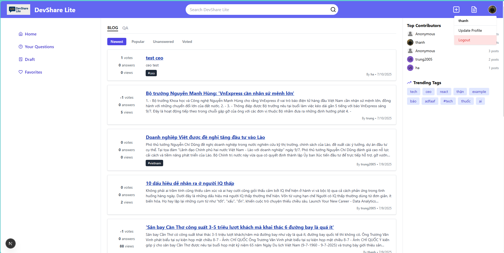
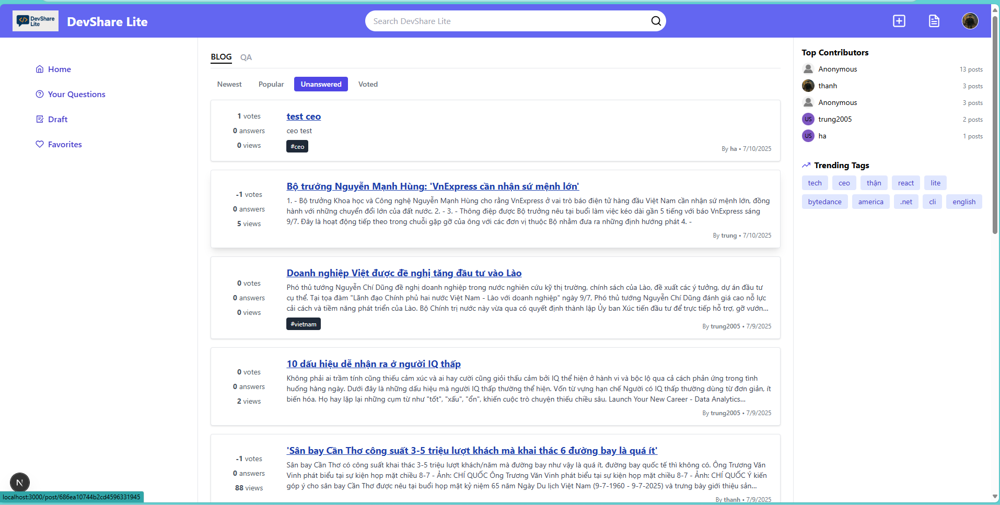

# Chức năng của sản phẩm
## Các chức năng chính của sản phẩm 
*Lưu ý 1: Các dữ liệu đang sử dụng chỉ với mục đích là test sản phẩm, khi đưa vào sử dụng sẽ hướng tới là một diễn đàn công nghệ*
*Lưu ý 2: những phần có chữ (new) là những chức năng cải tiến sao cho hoàn thiện hơn so với chức năng cơ bản*
### Xác thực người dùng 
1. Đăng ký tài khoản mới
- Người dùng nhập email, username muốn tạo và mật khẩu của tài khoản 

2. Đăng nhập hệ thống
- Người dùng sử dụng tài khoản đã đăng ký để đăng nhập vào hệ thống, Sử dụng token-based authentication (JWT lưu trong cookie).

3. Đăng xuất khỏi hệ thống 


### Quản lý bài viết
- Tạo bài viết mới 
1. Người dùng bấm vào biểu tượng dấu + trên thanh điều hướng để thêm bài viết mới
2. Khi đó hệ thống sẽ chuyển trang tới giao diện tạo bài viết 

3. Sau khi tạo xong, nếu thành công hệ thống sẽ hiện thông báo tạo thành công và link bài viết đã tạo 


- Lưu trạng thái Draft hoặc Publish công khai 
1. Khi tạo bài viết, người dùng có thể chọn trạng thái của bài viết là Draft hoặc Public 

2. Nếu bài post của bạn public, nó sẽ hiện trong mục Your post; còn nếu bài viết của bạn là draft nó sẽ hiển thị ở phần Draft 


3. Khi bấm vào mỗi bài post nó sẽ hiển thị cụ thể bài viết ra và các nút chỉnh sửa (Edit) hoặc xóa (Delete)
.png)
.png)
**Giao diện xem lại bài post đã đăng public**

**Giao diện xem lại bài post đã nháp**
4. Tại giao diện xem lại bài post đã đăng, bạn có thể xem ai đã tương tác với bài viết của mình (upvote/downvote/favorite) **(new)**


- Xem danh sách bài viết
1. Người dùng có thể xem danh sách bài viết qua giao diện index mà không cần phải login, nhưng để comment, vote, favorite, tạo bài post thì cần phải đăng nhập (phân quyền) **(new)**


2. Mỗi một trang sẽ có 10 bài viết, khi quá 10 bài viết sẽ tiến hành phân trang 
*Ảnh dưới là giảm mỗi trang xuống 3 để test*


3. Khi nhấn vào tiêu đề bài viết bạn sẽ được chuyển trang tới bài viết chi tiết 

- Tương tác với một bài viết
.png)
.png)
1. Tại bài viết bạn có thể trả lời câu hỏi hoặc comment bài viết, thậm chí bạn có thể trả lời một comment và vote comment, nếu đã vote trước đó có thể nhấn thêm một lần nữa để hủy vote (new) đó 

Nếu bạn chưa đăng nhập nó sẽ hiển thị alert bạn phải đăng nhập với có thể post 


2. Với mỗi bài viết bạn có thể upvote/downvote/favorite (save) bài viết đó, nếu đã vote trước đó có thể nhấn thêm một lần nữa để hủy vote 


3. Bạn có thể xem lại các bài viết mình đã favorite (save) ở giao diện favorites 

Khi bạn bám vào một bài viết sẽ đưa về giao diện xem bài post cụ thể đó 

### Tìm kiếm 
- Bạn có thể tìm kiếm bài viết theo tiêu đề hoặc nội dung 


### Trang cá nhân 
- Bạn nhấn vào biểu tượng avatar của bản thân, nó sẽ hiển thị 2 lựa chọn, bạn bấm vào lựa chọn Update Profile, bạn sẽ có thể xem được thông tin hiện tại của mình và có thể chỉnh sửa thông tin 


### Chế độ lọc bài viết (new)
- Bạn có thể lọc bài viết theo các tiêu chí sau: 
    - newest: sắp xếp theo thời gian đăng 
    - unanswered: các bài viết chưa có câu trả lời/bình luận
    - popular: sắp xếp theo lượt views
    - voted: sắp xếp theo `upvote - downvote`




### Bảng xếp hạng 
- Hệ thống sẽ xếp hạng top 5 người có nhiều bài post nhất và 10 tags phổ biến nhất các bài viết


## Các vấn đề gặp phải 
1. Avatar không hiển thị sau khi tải lại trang:
Do ban đầu ảnh đại diện được lưu cục bộ (local path), nên khi tải lại trang hoặc deploy, ảnh không còn tồn tại. Giải pháp là sử dụng Cloudinary để tải ảnh lên và lưu lại đường dẫn URL mạng để ảnh luôn hiển thị được mọi lúc.

2. Một trang quá dài, khó đọc và bảo trì:
Khi giao diện có quá nhiều logic và phần hiển thị, việc nhồi nhét vào một file khiến code rối và khó sửa lỗi. Cách xử lý là chia nhỏ giao diện thành các component riêng biệt (ví dụ: PostCard, CommentList, CommentEditor, v.v.) để dễ tái sử dụng và bảo trì.

3. Layout giao diện không đồng nhất giữa các trang:
Do mỗi trang có cấu trúc khác nhau nên cảm giác không thống nhất, thiếu chuyên nghiệp. Đã giải quyết bằng cách tạo component ThreeColumnLayout làm bố cục chuẩn cho các trang chính, giúp dễ kiểm soát và đồng bộ hóa giao diện.

4. Top contributors thay đổi liên tục sau mỗi lần refresh:
Nguyên nhân là có nhiều người dùng có cùng số lượng bài viết, nên mỗi lần tải lại danh sách được sắp xếp khác nhau. Để khắc phục, đã thêm tiêu chí phụ để sắp xếp theo userId (hoặc _id) khi số lượng bài viết bằng nhau.

5. Chức năng tìm kiếm quá rộng:
Việc tìm kiếm ban đầu có thể tìm ra các bài viết chỉ vì trùng một phần nhỏ ký tự, không đúng mục tiêu. Đã chỉnh lại thuật toán để chỉ tìm theo từ khóa đầy đủ, giúp kết quả chính xác và hợp lý hơn.

6. Markdown viết đúng nhưng hiển thị không như mong muốn:
Khi viết bài theo định dạng Markdown, người dùng không thấy được bài sẽ hiển thị như thế nào. Đã thêm chức năng Markdown Preview giúp người dùng xem trước nội dung được render.

7. Dữ liệu không cập nhật ngay sau tương tác (like, vote, comment...):
Sau khi người dùng tương tác, hệ thống không phản hồi ngay lập tức, gây nhầm lẫn. Đã sửa bằng cách cập nhật lại state người dùng sau mỗi hành động (như vote, comment) để phản ánh đúng trạng thái mới.

8. Khi truy xuất dữ liệu người dùng từ backend, có sự khác biệt giữa hai định dạng ID:

- `user._id`: là kiểu ObjectId của MongoDB

- `user.id`: là chuỗi string sau khi chuyển đổi (thường xuất hiện ở frontend hoặc trong dữ liệu từ API)

Điều này dễ gây lỗi so sánh, truy cập, hoặc gửi request nếu không nhất quán.
- Cách xử lý:
    - Ở phía frontend, luôn kiểm tra xem user._id hay user.id tồn tại, sau đó dùng cái có giá trị để gửi API (const userId = user?._id || user?.id).
    - Đồng thời, sau khi cập nhật user ở backend, kiểm tra kỹ object trả về: nếu chỉ có id thì ánh xạ lại thành _id trước khi set lại state người dùng.
- Ví dụ:
```
ts
const userRaw = res.data.user ?? res.data;
const plainUser = userRaw._doc ?? userRaw;

if (!plainUser._id && plainUser.id) {
  plainUser._id = plainUser.id;
}
```
- Điều này giúp đảm bảo sự thống nhất trong toàn bộ hệ thống, đặc biệt khi lưu dữ liệu vào localStorage, gọi API hoặc truyền props cho các component con.

## Các giới hạn đã biết của sản phẩm
1. **Hệ thống lọc bài viết còn đơn giản**  
   Hiện tại chưa hỗ trợ kết hợp nhiều bộ lọc cùng lúc. Ví dụ: người dùng không thể lọc các bài viết vừa “Popular” vừa “Unanswered”.

2. **Chưa có hệ thống thông báo**  
   Sản phẩm chưa hỗ trợ thông báo real-time như khi có người trả lời bình luận, vote bài viết hoặc mention người dùng.

3. **Chưa hỗ trợ quên mật khẩu**  
   Hệ thống chưa có chức năng cấp lại mật khẩu nếu người dùng quên (forgot password / reset password).

4. **Chưa có tính năng xem lịch sử chỉnh sửa**  
   Người dùng không thể xem các phiên bản trước của bài viết hoặc bình luận đã chỉnh sửa.

5. **Chức năng tìm kiếm còn hạn chế**  
   Tìm kiếm hiện tại chỉ đơn giản dựa trên tiêu đề và nội dung. Chưa hỗ trợ tìm theo tag, tác giả (user), hoặc gợi ý nâng cao.

6. **Quy trình đăng ký / đăng nhập còn đơn giản**  
   - Đăng ký chưa có bước xác minh email để đảm bảo tính xác thực tài khoản.  
   - Đăng nhập chưa có xác minh bổ sung (như mã OTP, reCAPTCHA, xác thực hai lớp).

7. **Hệ thống phân quyền đơn giản**
   - Hệ thống hiện tại chỉ phân quyền người đã đăng nhập và người chưa đăng nhập, cần phải có admin kiểm soát cả hệ thống nữa 

## Định hướng tương lai
1. Thông báo và tương tác real-time
Tích hợp WebSocket hoặc Pusher để hiển thị thông báo tức thời khi có người:
- Bình luận / trả lời bài viết
- Vote bài viết hoặc bình luận
- Mention tên người dùng

2. Tăng cường bảo mật và xác thực tài khoản
- Thêm xác minh email khi đăng ký
- Hỗ trợ đặt lại mật khẩu nếu quên
- Tích hợp xác thực hai bước (2FA)
- Thêm reCAPTCHA khi đăng nhập để chống spam/bot

3. Nâng cấp hệ thống tìm kiếm và bộ lọc
- Tìm kiếm theo tag, người dùng, loại bài viết (blog, Q&A)
- Cho phép kết hợp nhiều tiêu chí lọc (VD: popular + unanswered + tag)
- Cải thiện thuật toán sắp xếp kết quả theo mức độ liên quan và tần suất từ khóa

4. Phân quyền người dùng và quản trị
- Xây dựng hệ thống phân quyền rõ ràng:
    - User: viết bài, bình luận, vote
    - Admin/Moderator: duyệt bài viết, xóa nội dung vi phạm, quản lý người dùng
- Thêm chức năng báo cáo bài viết, khóa tài khoản vi phạm

5. Xem lịch sử chỉnh sửa bài viết / bình luận
- Hiển thị các phiên bản trước của bài viết hoặc bình luận đã được chỉnh sửa
- Cho phép so sánh nội dung giữa các phiên bản

6. Phân tích hành vi người dùng
- Theo dõi hành vi đọc bài, lượt click, thời gian ở lại bài viết
- Gợi ý bài viết liên quan dựa trên hành vi và sở thích
- Đề xuất tag khi viết bài mới dựa trên nội dung

7. Tích hợp AI hỗ trợ người dùng
- AI gợi ý tiêu đề, tag và nội dung khi viết bài
- Chatbot trợ lý hướng dẫn sử dụng hệ thống
- Phân tích nội dung để phát hiện bài trùng lặp hoặc spam

8. Cải tiến giao diện và trải nghiệm người dùng
- Responsive tốt hơn trên thiết bị di động
- Thêm chế độ Dark Mode
- Live Markdown Preview khi viết bài
- Hệ thống gợi ý tag và validate nội dung bài viết trước khi đăng

9. Xây dựng cộng đồng và tương tác sâu hơn
- Hệ thống follow người dùng
- Tin nhắn cá nhân (Direct Message)
- Thống kê người dùng nổi bật, bài viết nổi bật theo tuần/tháng
- Hệ thống điểm, huy hiệu (badge), bảng xếp hạng người dùng